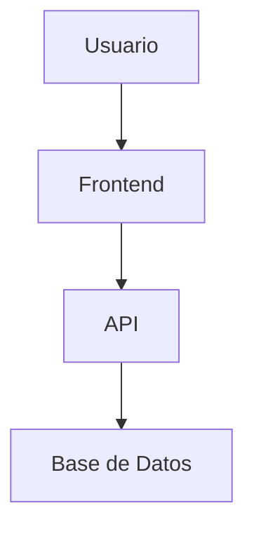

# System Architecture

<!-- 
INSTRUCCIONES:
Este archivo documenta la ARQUITECTURA de tu sistema.
Se genera automáticamente con /map pero puedes editarlo para agregar detalles.
-->

## 🏗️ Vista General

**Tipo de aplicación:** [Web app, API, Dashboard, etc.]

**Patrón arquitectónico:** [MVC, Microservicios, Jamstack, etc.]

---

## 📦 Componentes Principales

### Frontend
- **Framework:** [Nombre del framework]
- **Responsabilidades:** [Qué hace]
- **Tecnologías clave:** [Lista de libs/herramientas]

### Backend (si aplica)
- **Framework:** [Nombre del framework]
- **Responsabilidades:** [Qué hace]
- **Tecnologías clave:** [Lista de libs/herramientas]

### Base de Datos
- **Tipo:** [SQL, NoSQL, etc.]
- **Provider:** [Supabase, MongoDB, etc.]
- **Esquema principal:** [Descripción breve]

---

## 🔄 Flujo de Datos

```
Usuario → [Frontend] → [API/Backend] → [Base de Datos]
                ↓
         [Servicios Externos]
```

---

## 🌐 Integraciones Externas

| Servicio | Propósito | Documentación |
|----------|-----------|---------------|
| [Nombre] | [Para qué se usa] | [Link a docs] |

---

## 📂 Estructura de Carpetas

```
proyecto/
├── src/
│   ├── components/     # Componentes reutilizables
│   ├── pages/          # Páginas/rutas
│   ├── layouts/        # Layouts compartidos
│   ├── lib/            # Utilidades y helpers
│   └── styles/         # Estilos globales
├── public/             # Assets estáticos
└── .gsd/               # Documentación GSD
```

---

## 🔐 Seguridad & Autenticación

**Estrategia:** [Descripción de cómo manejas auth]

**Provider:** [Supabase Auth, Auth0, custom, etc.]

---

## 📊 Diagramas

<!-- Puedes agregar diagramas Mermaid aquí -->



---

## 📝 Notas Técnicas

[Detalles importantes sobre la arquitectura, limitaciones conocidas, etc.]
